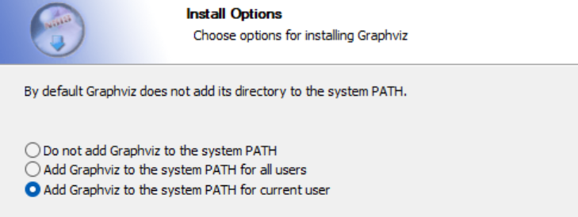
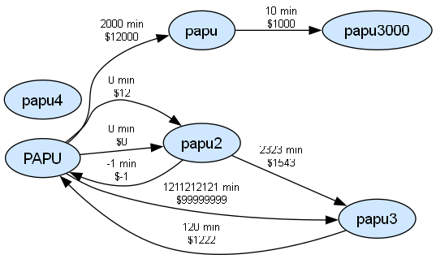

# Proyecto_ChosenMove_MDJG

Para ejecutar el código primero debemos compilar en PowerShell 
````
gcc main.c funciones.c tdas/*.c -o programa.exe
````

Y luego ejecutar:
````
.\programa.exe   
````
Para Realizar Cambios y Commits en Git Bash:
````
git add .                 
````
````
git commit -m "Mensaje"   
````
Para Enviar Cambios a GitHub:
````
git push origin main
````
Para agregar los cambios realizados por otros 
````
git pull
````
Si les sale un mensaje en inglés, presionan la tecla "Esc" y escriben ":wq" xd

# Cosas que faltan:

## Eliminar lugar de los grafos (agregar al main)
## Mostrar lista de lugares añadidos (agregar al main)
## Eliminar conexion de los grafos (agregar al main)
## BusquedaRapidez
## BusquedaEconomica


## Descripción 
Este programa permite a los usuarios encontrar la ruta más óptima, bajo los criterios seleccionados, en una red de transporte
construida manualmente, añadiendo cada lugar con su nombre y cada conexion desde un lugar de origen a un lugar de destino
con su respectivo tiempo y costo de viaje, especificando siempre a que medio de transporte pertenece.

La red se divide en cuatro grafos independientes:

- Caminando
- Metro
- Micro
- Colectivo

Además, el programa permite visualizar gráficamente la red mediante Graphviz, generando automáticamente imágenes de los grafos creados.

## Pasos para compilar y ejecutar:

1. Descargar los archivos necesarios o guardar el link del repositorio de github
2. Abrir los archivos en VisualStudio o importar el repositorio en replit

Para ejecutar el código primero debemos compilar en PowerShell 
````
gcc main.c funciones.c tdas/*.c -o programa.exe
````

Y luego ejecutar:
````
.\programa.exe   
````

# Graphviz
Para que funcione el graficar, es necesario instalar Graphviz, y cuando pregunte por instalar 
system Path:


hay que seleccionar la 2da o 3ra opcion, luego de eso funciona sin problemas.

## Problemas conocidos

Las redes de transporte son independientes, por lo que actualmente no se permiten viajes que combinen distintos medios de transporte.

El agregar conexiones no verifica si los nombres existen, si no existen crea el nodo pero solo si el de lugar de origen si existia anteriormente,si ninguno de los ingresados o el de origen no existe, no pasa nada.

Tambien se puede hacer una dobleconxion entre los dos nodos con distintos valores de tiempo y costo,
puedo poner varias conexiones en la misma dirrecion con distintos valores.

El agregar lugar no da retroalimentacion si se ingresa el mismo nombre de un lugar ya existente, solo indica que se agrego el lugar




## Funcionalidades
- ### Buscar Ruta

Permite encontrar una ruta entre un origen y un destino utilizando uno de los medios de transporte disponibles.

El usuario debe ingresar:

- Lugar de origen.
- Lugar de destino.
- Tipo de transporte.
- Criterio de búsqueda. (Más rapida, más económica, equilibrada)

El sistema verifica que ambos lugares existan en la red seleccionada antes de ejecutar la búsqueda.

- ### Gestionar Lugares

Permite administrar los vértices de cada red.

- #### Agregar Lugar

Agrega un nuevo lugar a la red seleccionada.

- #### Eliminar Lugar

Elimina un lugar junto con todas sus conexiones asociadas.

- #### Mostrar Lista de Lugares

Imprime todos los lugares registrados en la red seleccionada.

- ### Agregar Conexión

El usuario ingresa:

- Lugar de origen.
- Lugar de destino.
- Tiempo de viaje.
- Costo.
- Tipo de transporte.

La conexión queda almacenada dentro de la lista de adyacencia del lugar origen.

- #### Eliminar Conexión

Elimina una conexión específica entre dos lugares.


- ## #Mostrar Red de Transporte

Genera una representación visual de cada grafo mediante Graphviz.

Para cada conexión se muestra:

````
Origen → Destino
Tiempo de viaje
Costo
````

El programa genera automáticamente:
````
red_caminando.png
red_metro.png
red_micro.png
red_colectivo.png
````


## Ejemplo de Uso

### Menú Principal

========================================
        TRANSPORTE INTELIGENTE
========================================

1) Buscar ruta
2) Gestionar lugares
3) Gestionar conexiones
4) Mostrar red de transporte
5) Salir


### Agregar Lugar
Entrada:
````
2
1

Casa

1
````
Salida esperada:
````
Lugar agregado exitosamente
````

### Agregar Conexión
Entrada:
````
3
1

Origen: Casa
Destino: Universidad
Tiempo: 10
Costo: 500
Tipo: Micro
````
Salida esperada:
````
Conexion agregada exitosamente
````

### Buscar Ruta Equilibrada

Entrada:
````
1
3

Origen: Casa
Destino: Universidad
````
Salida esperada:
````
===== RUTA ENCONTRADA =====

Casa -> Universidad

Tiempo total: 10 minutos
Costo total: $500
````
### Mostrar Red de Transporte
Entrada:
````
4
````
Salida esperada:
````
Generando grafos...

Imagen generada: red_caminando.png
Imagen generada: red_metro.png
Imagen generada: red_micro.png
Imagen generada: red_colectivo.png
````

Se abrirán automáticamente las imágenes generadas por Graphviz mostrando la estructura de cada red.

### Salir del Programa
Entrada:
````
5
````
Salida esperada:
````
Cerrando ChosenMove...
````